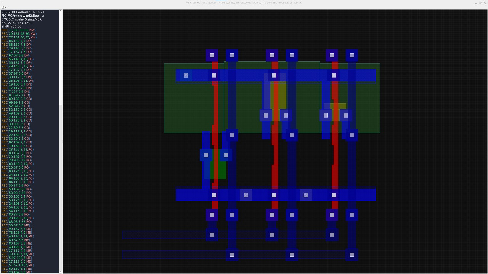

# MSK Viewer and Editor

Simple viewer and editor of msk files made using C++ and Qt. 



## Features

- Open, save and create MSK files.
- Syntax highting
- MSK code editor
- Draw topology using different type of layers(PO, ME, M1 and e.t.c)

## Build project

```
git clone https://github.com/ruykaji/msk-viewer-editor.git

cd msk-viewer-editor

cmake --build .
```
